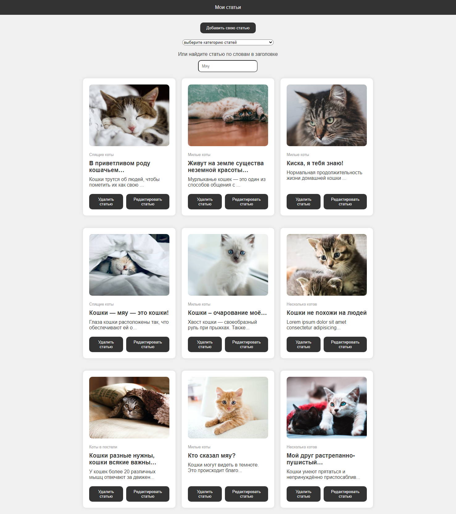
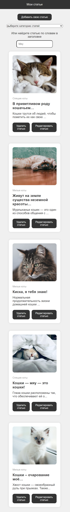
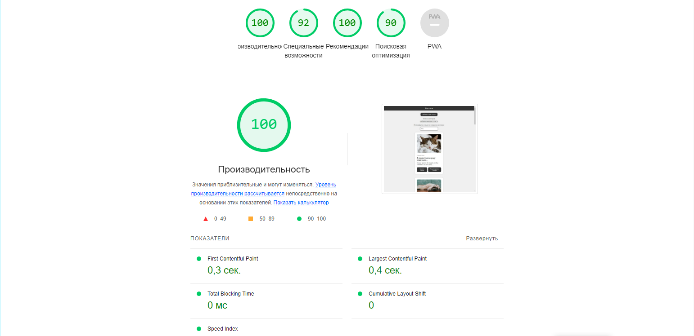

# [Интерактивный портал со статьями](https:// "Ссылка на сайт")

## Описание проекта

Этот проект представляет собой интерактивное веб-приложение для отображения статей о котах, разработанное с использованием ванильного JavaScript. 

   Технологии: HTML, CSS, JavaScript.

   Основные функции:

   * Просмотр статей, сортировка статей, поиск статей по заголовкам, добавление статей.
   * Редактирование статей.
   * Удаление статей.
   * Хранение данных: Все данные о статьях сохраняются в localStorage, что позволяет сохранять информацию между сессиями.
   * Делегирование событий: Вместо назначения обработчиков событий каждой статье индивидуально, этот проект использует делегирование событий, назначая обработчики событий родительскому элементу. Это упрощает управление памятью и предотвращает утечки памяти при удалении статей.
   * Debounce: Этот проект использует функцию debounce для предотвращения частого вызова функции поиска при вводе в поле поиска, что улучшает производительность приложения.

Этот проект демонстрирует мои навыки в области JavaScript, включая работу с DOM, обработку событий, использование localStorage и написание чистого и модульного кода. 

## Скриншоты сайта

Здесь представлены два скриншота сайта:

1. Скриншот десктопной версии сайта
 

2. Скриншот мобильной версии сайта

## Аналитика сайта

Сайт проанализирован встроенным инструментом chrome браузера Lighthouse

